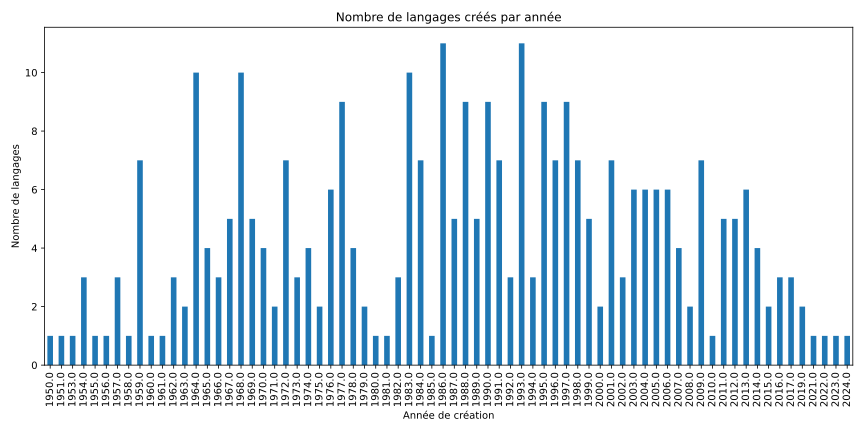

# Évolution des langages de programmation

## Introduction
Ce document présente un aperçu des langages de programmation, y compris des statistiques sur leur création au fil des années.

## Graphique des langages par ans

[Source des données](/Benchmark_Languages.md)

## Conclusion
Ce rapport fournit une vue d'ensemble des langages de programmation et leur évolution au fil des années. Les graphiques et les tableaux présentés ici aident à visualiser ces informations de manière claire et concise.
